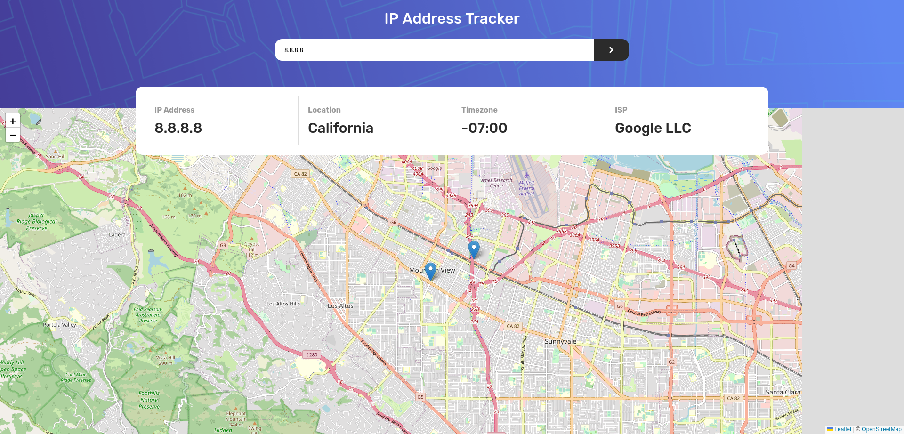
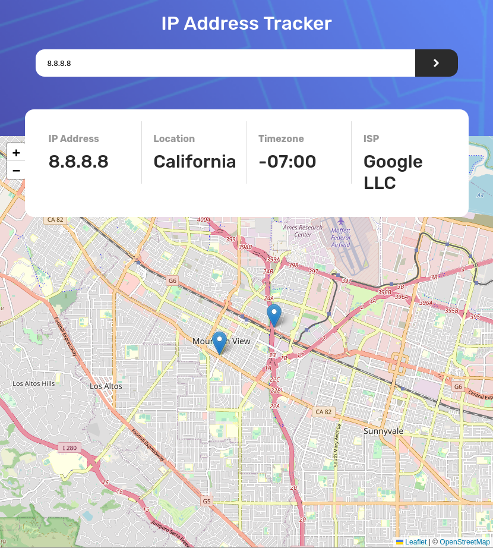

# Frontend Mentor - IP address tracker solution

This is a solution to the [IP address tracker challenge on Frontend Mentor](https://www.frontendmentor.io/challenges/ip-address-tracker-I8-0yYAH0). Frontend Mentor challenges help you improve your coding skills by building realistic projects.

## Table of contents

- [Overview](#overview)
  - [The challenge](#the-challenge)
  - [Screenshot](#screenshot)
  - [Links](#links)
- [My process](#my-process)
  - [Built with](#built-with)
  - [Useful resources](#useful-resources)
- [Author](#author)

## Overview

### The challenge

Users should be able to:

- View the optimal layout for each page depending on their device's screen size
- See hover states for all interactive elements on the page
- See their own IP address on the map on the initial page load
- Search for any IP addresses or domains and see the key information and location

### Screenshot

### Links

- Solution URL: [Solution URL here](https://github.com/Jalal-Aljhny/Frontend-Mentor-IP-Address-Tracker)
- Live Site URL: [Live site URL here](https://jalal-aljhny.github.io/Frontend-Mentor-IP-Address-Tracker/)

## My process

### Built with

- Semantic HTML5 markup
- CSS custom properties
- Flexbox
- SASS
- LeafletJS
- IP Geolocation API by IPify

### Useful resources

- [IPify Documentation](https://geo.ipify.org/docs) .
- [LeafletJS Documentation](https://leafletjs.com/reference.html).

## Author

- githup - [Jalal Aljhny](https://github.com/Jalal-Aljhny)
- Frontend Mentor - [@Jalal Aljhny](https://www.frontendmentor.io/profile/Jalal-Aljhny)

